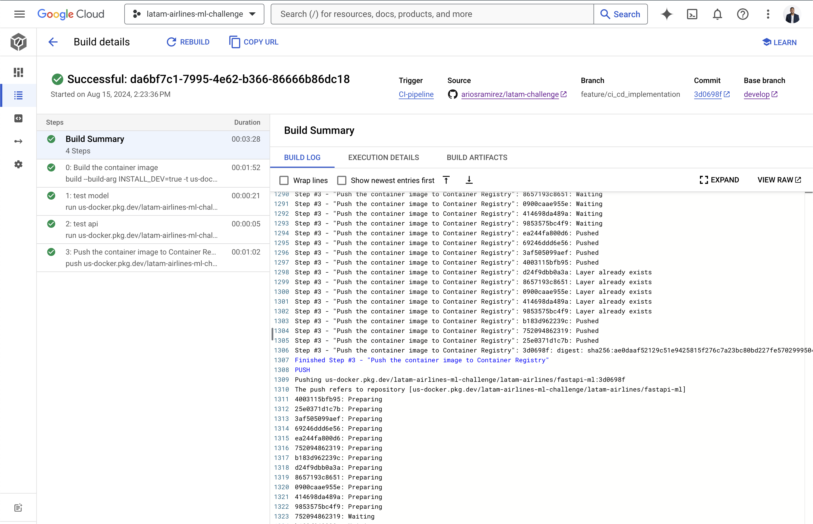
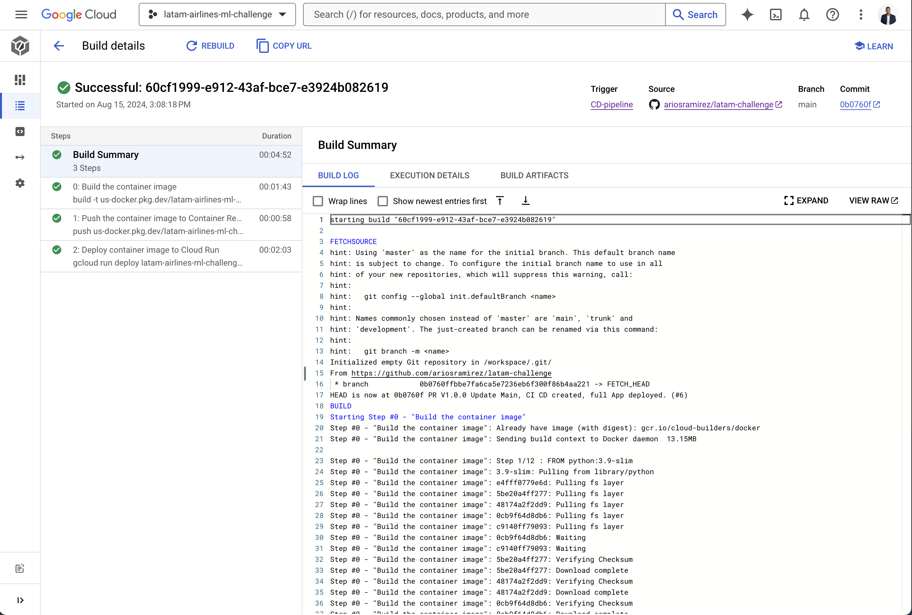
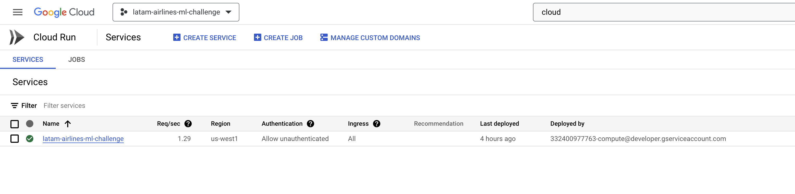
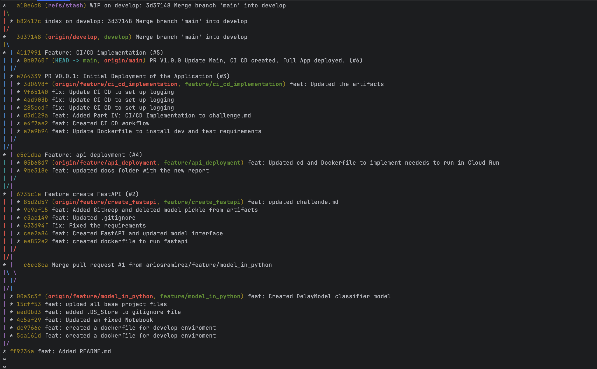

# Challenge Report

---

## Executive Summary

This report details the successful completion of a machine learning challenge, involving model selection, deployment, and continuous integration/continuous delivery (CI/CD) implementation. The project leveraged FastAPI for model deployment and Google Cloud Platform (GCP) tools for scalable, cloud-based operations.

## Part I: Model

### Chosen Model: Logistic Regression

#### Rationale:
- **Interpretability:** Directly reveals the relationship between features and outcomes, making it easy to understand and communicate.
- **Efficiency:** Computationally fast and lightweight, ideal for large datasets and rapid deployment.

#### Conclusion:
Logistic Regression was selected for its balance of interpretability and efficiency, making it the most suitable choice for this task.

#### Model Implementation
The model was implemented using the `LogisticRegression` with custom class weights to account for the imbalance in the delay vs. no-delay classes. The categorical features were one-hot encoded, and a preprocessing pipeline was constructed to ensure clean input for the model.

##### Key Outcomes:
- **Preprocessing:** A pipeline that handles missing data and one-hot encodes categorical features.
- **Model Fitting:** Logistic Regression with custom class weights.
- **Artifact Management:** Functions to save and load model artifacts, facilitating deployment and scaling.

---

## Part II: Model Deployment with FastAPI

### API Implementation
- **API Development:** Developed a FastAPI-based API to serve the model for predictions, with endpoints for health checks and predictions.
- **Validation Handling:** Custom validation ensures invalid inputs return a `400 Bad Request`.
- **Docker Integration:** Created a `Dockerfile` for containerizing the FastAPI application.
- **Testing and Validation:** The API passes the provided tests using `make api-test`.

##### Key Outcomes:
- **Successful Deployment:** The API is robust and ready for production use.

---

## Part III: API Deployment to GCP Using Cloud Run and Cloud Build

### Summary of Changes:
- **Continuous Delivery (CD) Pipeline:** Implemented using Cloud Build, pushing the Docker image to Artifact Registry and deploying the FastAPI application to Google Cloud Run.
- **Cloud Run Deployment:** Updated the `Dockerfile` to expose port 8080. Adjusted the `Makefile` for stress testing against the deployed Cloud Run URL.
- **Dependency and Testing Updates:** Upgraded `locust` for stress testing.

### Deployment Success:
- The deployment was verified, and the API was successfully deployed on Cloud Run.

---

## Part IV: CI/CD Implementation

- **CI Pipeline:** Created using Cloud Build, automatically building Docker images and running tests on PR creation.
- **CD Pipeline Enhancement:** Enhanced to trigger deployment on merging to the main branch.
- **Cloud Build vs. GitHub Actions:** Chose Cloud Build for easier GCP resource management, scalability, and integration.
- **Dockerfile Updates:** Modified for optional development and testing dependencies during CI.

### Cloud Build CI Success

### Cloud Build CD Success

### Cloud Run

### Git Flow
