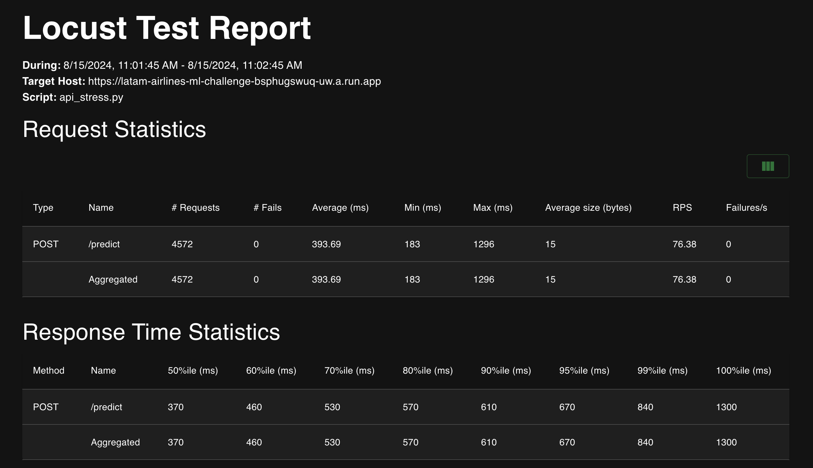
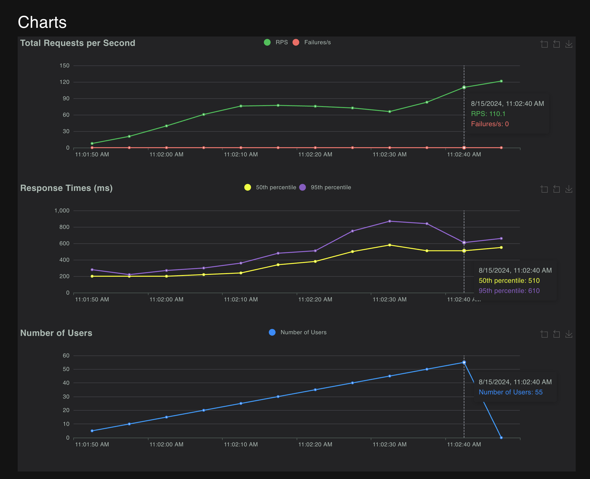

# Challenge Report

---
## Part I: Model

### Chosen Model: Logistic Regression

#### Rationale:

- **Interpretability:** Directly reveals the relationship between features and outcomes, making it easy to understand and communicate.
  
- **Efficiency:** Computationally fast and lightweight, ideal for large datasets and rapid deployment.

#### Conclusion:

Logistic Regression was selected for its balance of interpretability and efficiency, making it the most suitable choice for this task.

#### Model implementation

The model was implemented using the `LogisticRegression` with custom class weights to account for the imbalance in the delay vs. no-delay classes. The categorical features (e.g., airline, flight type, and month) were one-hot encoded to ensure they were properly represented in the model. A preprocessing pipeline was constructed to handle missing data and to ensure that the model received clean and well-structured input.

The entire model and its preprocessing steps were integrated into a `DelayModel` class, which encapsulates the training, prediction, and serialization (saving/loading) processes. This modular approach ensures that the model can be easily deployed and maintained in a production environment.

The model's artifacts, including the trained model and the preprocessing pipeline, are saved to disk using `joblib`, allowing for easy persistence and reusability. This also supports rapid deployment, as the model can be loaded and used for predictions without needing to retrain. This implementation could be changed to a save in a cloud storage. 

##### Key Components:
- **Preprocessing:** A pipeline that handles missing data and one-hot encodes categorical features.
- **Model Fitting:** Logistic Regression with custom class weights to address class imbalance.
- **Prediction Handling:** Includes error handling to load the model if it's not already fitted, ensuring robustness in production environments.
- **Artifact Management:** Functions to save and load model artifacts, facilitating deployment and scaling.

This approach provides a comprehensive solution that balances accuracy, interpretability, and operational efficiency, making it well-suited to the challenge of predicting flight delays.

---
## Part II: Model Deployment with FastAPI

### API implementation

- **API Development**: Developed a FastAPI-based API in `api.py` to serve the model for predictions. This API includes endpoints for health checks and making predictions.
- **Validation Handling**: Implemented custom validation for input data, ensuring that invalid inputs return a `400 Bad Request` status.
- **Docker Integration**: Created a `Dockerfile` to containerize the FastAPI application, including necessary system dependencies and Python packages.
- **Testing and Validation**: Ensured that the API passes the provided tests using `make api-test`.

---
## Part III: API Deployment to GCP Using Cloud Run and Cloud Build

### Summary of Changes:

- **Continuous Delivery (CD) Pipeline**: Implemented a CD pipeline using Cloud Build, which builds and pushes the Docker image to Artifact Registry and deploys the FastAPI application to Google Cloud Run.
  
- **Cloud Run Deployment**: Updated the `Dockerfile` to expose port 8080, which is the default for Cloud Run. Adjusted the `Makefile` to point the stress test to the deployed Cloud Run URL.

- **Dependency and Testing Updates**: Upgraded `locust` for stress testing and adjusted test configurations to ensure compatibility with the deployment environment.

### Deployment Success:

- The deployment process was verified, and the API was successfully deployed on Cloud Run. Attached is the stress test report, confirming the successful operation of the API under load.

---
